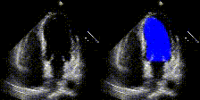
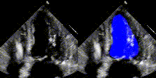
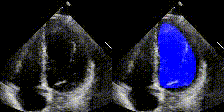
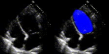

EchoNet-Dynamic: Interpretable AI for beat-to-beat cardiac function assessment
------------------------------------------------------------------------------

EchoNet-Dynamic is a end-to-end beat-to-beat deep learning model for
  1) semantic segmentation of the left ventricle
  2) prediction of ejection fraction by entire video or subsampled clips, and
  3) assessment of cardiomyopathy with reduced ejection fraction.

For more details, see the acompanying paper,

> [**Interpretable AI for beat-to-beat cardiac function assessment**](https://www.medrxiv.org/content/10.1101/19012419v2) 
  by David Ouyang, Bryan He, Amirata Ghorbani, Curt P. Langlotz, Paul A. Heidenreich, Robert A. Harrington, David H. Liang, Euan A. Ashley, and James Y. Zou

Dataset
-------
We share a deidentified set of 10,000 echocardiogram images which were used for training EchoNet-Dynamic.
Preprocessing of these images, including deidentification and conversion from DICOM format to AVI format videos, were performed with OpenCV and pydicom. Additional information is at https://douyang.github.io/EchoNetDynamic/. These deidentified images are shared with a non-commerical data use agreement.

Examples
--------

We show examples of our semantic segmentation for nine distinct patients below.
Three patients have normal cardiac function, three have low ejection fractions, and three have arrhythmia.
No human tracings for these patients were used by EchoNet-Dynamic.

| Normal                                 | Low Ejection Fraction                  | Arrhythmia                             |
| ------                                 | ---------------------                  | ----------                             |
|  |  |  |
|  |  |  |
|  |  |  |

Installation
------------

First, clone this repository and enter the directory by running:

    git clone https://github.com/douyang/EchoNetDynamic
    cd EchoNetDynamic

EchoNet-Dynamic is implemented for Python 3, and depends on the following packages:
  - NumPy
  - PyTorch
  - Torchvision
  - OpenCV
  - skimage
  - sklearn
  - tqdm

Echonet-Dynamic and its dependencies can be installed by navigating to the cloned directory and running

    pip install --user .

Usage
-----
### Preprocessing DICOM Videos

The input of EchoNet-Dynamic is an apical-4-chamber view echocardiogram video of any length. The easiest way to run our code is to use videos from our dataset, but we also provide a Jupyter Notebook, `ConvertDICOMToAVI.ipynb`, to convert DICOM files to AVI files used for input to EchoNet-Dynamic. The Notebook deidentifies the video by cropping out information outside of the ultrasound sector, resizes the input video, and saves the video in AVI format. 

### Setting Path to Data

By default, EchoNet-Dynamic assumes that a copy of the data is saved in a folder named `echonet-dynamic/` in this directory.
This path can be changed by creating a configuration file named `echonet.cfg` (an example configuration file is `example.cfg`).

### Running Code

EchoNet-Dynamic has three main components: segmenting the left ventricle, predicting ejection fraction from subsampled clips, and assessing cardiomyopathy with beat-by-beat predictions.
Each of these components can be run with reasonable choices of hyperparameters with the scripts below.
We describe our full hyperparameter sweep in the next section.

#### Frame-by-frame Semantic Segmentation of the Left Ventricle

    cmd="import echonet; echonet.utils.segmentation.run(modelname=\"deeplabv3_resnet50\",
                                                        save_segmentation=True,
                                                        pretrained=False)"
    python3 -c "${cmd}"

This creates a directory named `output/segmentation/deeplabv3_resnet50_random/`, which will contain
  - log.csv: training and validation losses
  - best.pt: checkpoint of weights for the model with the lowest validation loss
  - size.csv: estimated size of left ventricle for each frame and indicator for beginning of beat
  - videos: directory containing videos with segmentation overlay

#### Prediction of Ejection Fraction from Subsampled Clips

    cmd="import echonet; echonet.utils.video.run(modelname=\"r2plus1d_18\",
                                                 frames=32,
                                                 period=2,
                                                 pretrained=True,
                                                 batch_size=8)"
    python3 -c "${cmd}"

This creates a directory named `output/video/r2plus1d_18_32_2_pretrained/`, which will contain
  - log.csv: training and validation losses
  - best.pt: checkpoint of weights for the model with the lowest validation loss
  - test_predictions.csv: ejection fraction prediction for subsampled clips

#### Beat-by-beat Prediction of Ejection Fraction from Full Video and Assesment of Cardiomyopathy

The final beat-by-beat prediction and analysis is performed with `scripts/beat_analysis.R`.
This script combines the results from segmentation output in `size.csv` and the clip-level ejection fraction prediction in `test_predictions.csv`. The beginning of each systolic phase is detected by using the peak detection algorithm from scipy (`scipy.signal.find_peaks`) and a video clip centered around the beat is used for beat-by-beat prediction.

### Hyperparameter Sweeps

The full set of hyperparameter sweeps from the paper can be run via `run_experiments.sh`.
In particular, we choose between pretrained and random initialization for the weights, the model (selected from `r2plus1d_18`, `r3d_18`, and `mc3_18`), the length of the video (1, 4, 8, 16, 32, 64, and 96 frames), and the sampling period (1, 2, 4, 6, and 8 frames).
